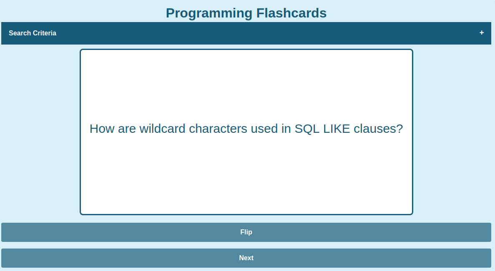
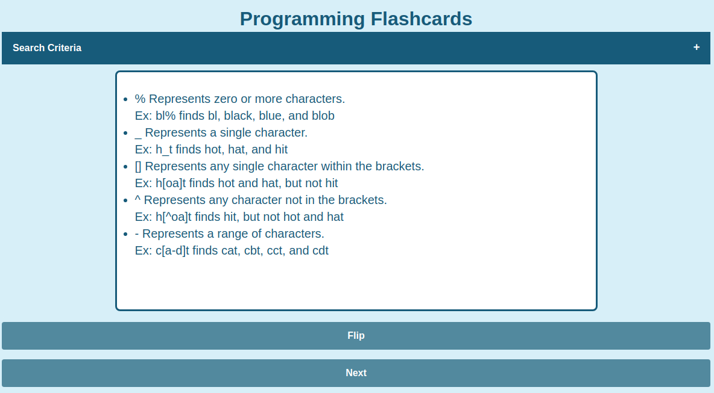
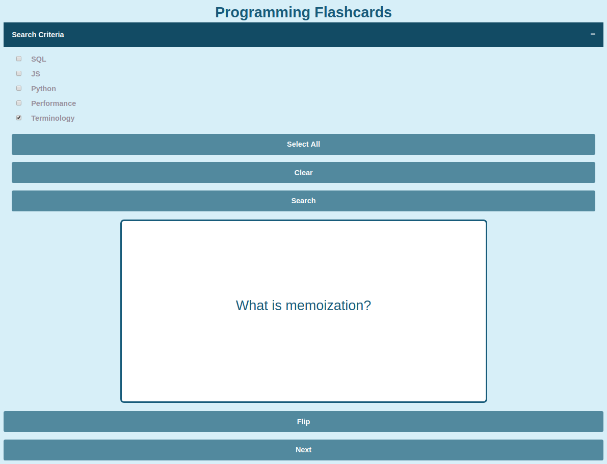

# Flashcards

A simple JS app to quiz myself on basic Computer Science concepts. Flashcards are shown at random, and returned to the deck immediately. 

## To Use

Cards display randomly. Click Next to switch to another card.

Click "Flip" to see the answer.

Expand the Search accordion to filter the cards shown.

## Future
- use arrow keys to flip/move to next card
- Fix grid-container class so it's a responsive grid (checkboxes move to next line on smaller windows)
- make "Flip" and "Next" buttons appear side by side
- add more cards...
- move to a database instead of having the cards hard-coded
- implement a mechanism for adding new cards within the app

## Installation
- download the html, css, and js files to the same repository
- load the html file into a browser
